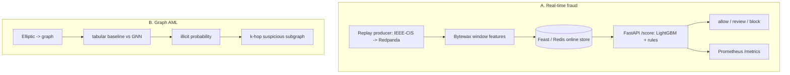

# Real-time Fraud + Graph AML · v1.0.0

[](https://github.com/dataeclipse/fraud-aml-realtime/actions/workflows/ci.yml)


Two connected subsystems in one repo:

- **A. Real-time fraud** - a transaction stream feeds online features; a low-latency LightGBM scorer
  and a velocity rule engine return an allow / review / block decision, with Prometheus metrics.
- **B. Graph AML** - a GNN (GraphSAGE / GAT) over the Elliptic transaction graph classifies nodes
  as illicit, compared honestly against a strong tabular baseline, with subgraph explanations.

## Problem
Banks treat fraud prevention and AML/CFT as a priority. A single classifier is not enough: the
production loop is stream -> online features -> model + rules -> decision -> monitoring, plus a graph
module for laundering patterns (smurfing, cycles) that a tabular model may miss. This repo builds
that whole loop and reports honest numbers for both parts.

## Architecture


## Data
Both real, from Kaggle. `data/` is in `.gitignore`.
- **IEEE-CIS Fraud Detection** - 590,540 transactions x 434 columns, ~3.5% fraud. Subsystem A.
- **Elliptic Data Set** - 203,769-node Bitcoin graph, 165 features, 234,355 edges, 49 time steps,
  9.8% illicit among labeled. Subsystem B.

## Quickstart
Requires [uv](https://docs.astral.sh/uv/) and (for the live contour) Docker. From the project dir:
```bash
uv run fraud-aml-export-model                           # train + bake the fraud model -> deploy/
docker compose -f infra/compose.yaml up --build -d      # Redpanda + Redis + /score api
uv run fraud-aml-produce --speedup 1000                 # replay transactions by time (WSL)
uv run fraud-aml-process                                # Bytewax fills Redis online features
curl -X POST localhost:8000/score -H 'content-type: application/json' -d '{
  "TransactionID": 1, "card1": 12345, "TransactionAmt": 100.0, "TransactionDT": 86400,
  "features": {"addr1": 200.0} }'
docker compose -f infra/compose.yaml --profile monitoring up -d   # + Prometheus (:9090)
```
Dev: `make lint` · `make type` · `make test`. GPU for the GNN (Phase B): install `torch` then
`torch-geometric` from the PyTorch CUDA index; the lock pins CPU torch. No `make` on Windows - call
the `uv run ...` equivalents.

## Results

### A. Fraud (time-based split, honest late-period test)
| Metric | Validation | Test (late) |
|---|---|---|
| PR-AUC | 0.394 | 0.263 |
| ROC-AUC | 0.879 | 0.845 |

Threshold by expected cost (FN=10, FP=1). The PR-AUC drop is temporal drift the time split exposes.
`/score` local latency p50 56.5 ms / p99 70.9 ms (excludes the Feast round-trip); the bottleneck is
feature-build, not the native `pred_contrib` reason codes. No train/serve skew: one
`assemble_features` for train and serve, asserted by a test. Details:
[fraud_baseline.md](docs/fraud_baseline.md), [serving.md](docs/serving.md).

### B. Graph AML - illicit F1 (temporal split)
| Feature set | LightGBM | GraphSAGE | GAT |
|---|---|---|---|
| Full (165) | **0.812** | 0.522 | 0.529 |
| Local (94) | **0.759** | 0.434 | - |

**Honest finding:** the boosted tabular model beats the vanilla GNN on both feature sets. On Elliptic
~71 of the 165 features are already neighborhood aggregates, so the graph signal is baked into the
node features (Weber et al. 2019: RandomForest 0.79 vs GCN 0.42). The value is the methodological
conclusion - a GNN is not a default win; validate it against a strong tabular baseline - plus a
suspicious-subgraph report for compliance. Details: [graph_aml.md](docs/graph_aml.md).

## Examples
`/score` (review, escalated by a velocity rule):
```json
{"score": 0.21, "decision": "review", "fired_rules": ["count_over_20"],
 "top_reason": "card1_freq (increases risk)", "model_version": "phase1-lgbm"}
```
Suspicious subgraph: top illicit-scored node with its neighbors and their scores (one suspicious
neighbor, the rest clean) - a compliance report. See [graph_aml.md](docs/graph_aml.md).

## Model card
[docs/model_card.md](docs/model_card.md) - both subsystems, data and limitations, metrics, no-skew,
decision logic, latency, explainability, limitations/risks, monitoring, governance (AML/CFT framing).

## Limitations
Demo/portfolio (not a live fraud or AML decision): anonymized proxy features; temporal drift in
fraud; the GNN does not beat the tabular baseline on Elliptic (by design of the dataset); the cost
threshold depends on FN/FP prices; the live demo needs Docker.

## Roadmap
| Phase | Content |
|---|---|
| 0 ✅ | Skeleton: structure, uv extras, ruff/mypy/pytest, CI, `/healthz` |
| 1 ✅ | Tabular fraud baseline (IEEE-CIS): time split, LightGBM, cost threshold, MLflow |
| 2 ✅ | Streaming: Redpanda replay + Bytewax windows + Feast/Redis, no skew |
| 3 ✅ | Real-time `/score` + rule engine, allow/review/block, latency budget, Prometheus |
| 4 ✅ | Graph AML on Elliptic: temporal split, tabular vs GraphSAGE/GAT, honest finding, subgraph |
| 5 ✅ | Docker/compose full contour + CI image build + model card + README |

## License
[MIT](LICENSE).
