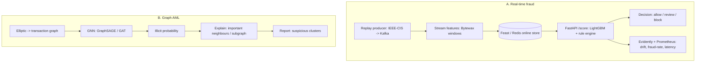

# Real-time Fraud + Graph AML

[](https://github.com/dataeclipse/fraud-aml-realtime/actions/workflows/ci.yml)


Two connected subsystems in one repo:

- **A. Real-time fraud** - a transaction stream feeds online features, a low-latency GBDT scorer
  and a rule engine return an allow / review / block decision, with fraud-rate and drift monitoring.
- **B. Graph AML** - a GNN (GraphSAGE / GAT) over the transaction graph flags illicit nodes and
  suspicious clusters that a tabular model misses, with neighbour/subgraph explanations.

> Status: Phase 0 (skeleton). Structure, tooling, CI, and `/healthz` are in place. Models and
> business logic land in Phases 1-5 (see [Roadmap](#roadmap)).

## Problem
Banks treat fraud prevention and AML/CFT as a priority. A single classifier is not enough: the
production loop is stream -> online features -> model + rules -> decision -> monitoring, plus a
graph module that catches laundering patterns (smurfing, cycles) invisible to a tabular model.

## Data
Both real, from Kaggle. `data/` is in `.gitignore`.
- **IEEE-CIS Fraud Detection** (competition `ieee-fraud-detection`, by Vesta) - real e-commerce
  transactions, ~590k rows, ~3.5% fraud, rich anonymized features + identity. Subsystem A.
  Accept the competition rules once on Kaggle, otherwise the download fails.
- **Elliptic Data Set** (dataset `ellipticco/elliptic-data-set`) - a real Bitcoin transaction
  graph, ~203k nodes, licit/illicit labels, 49 time steps. Subsystem B (the method transfers to a
  bank graph of client <-> account <-> counterparty).

## Architecture


## How to run
Requires [uv](https://docs.astral.sh/uv/). From `02-fraud-aml-realtime/`:
```bash
make install          # uv sync --extra data (core + dev + data layer)
make lint             # ruff check + ruff format --check
make type             # mypy strict on src
make test             # pytest
make run              # uvicorn on :8000, then curl http://localhost:8000/healthz
```
No `make` on Windows: call the `uv run ...` equivalents directly.

Heavy stacks are optional extras (installed per phase):
```bash
uv sync --extra ml        # tabular fraud + GNN (lightgbm/xgboost/shap, torch, torch-geometric)
uv sync --extra stream    # kafka/bytewax/feast/redis
```
GPU note: install `torch` (and then `torch-geometric`) from the PyTorch CUDA index for the RTX 4070;
`uv.lock` pins the CPU build from PyPI for reproducibility. Install `torch-geometric` after `torch`.

## Results
Filled per phase (PR-AUC and cost-based threshold for fraud; illicit F1 for the GNN vs the tabular
baseline).

## Roadmap
| Phase | Content |
|---|---|
| 0 ✅ | Skeleton: structure, uv/pyproject + extras, ruff/mypy/pytest/pre-commit, CI, `/healthz` |
| 1 | Tabular fraud baseline (IEEE-CIS): merge, features, imbalance, LightGBM, cost-based threshold |
| 2 | Streaming + online features (Kafka/Redpanda replay, Bytewax windows, Feast/Redis) |
| 3 | Real-time service + rule engine, allow/review/block, p99 SLA, Prometheus |
| 4 | Graph AML (GNN on Elliptic), beats tabular baseline on illicit F1, subgraph explanations |
| 5 | Monitoring + compose (kafka/redis/api/prometheus), demo, model card |

## License
[MIT](LICENSE).
