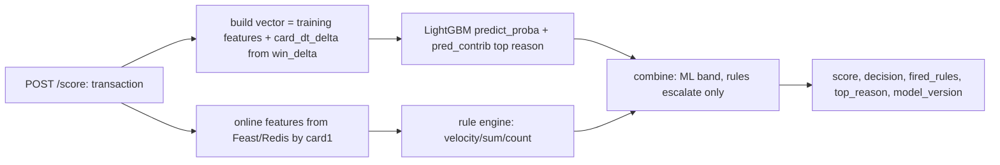

# Real-time /score service (Phase 3)

A FastAPI service that scores a transaction in real time: it reads online window features for the
card from Feast/Redis, builds the exact training feature vector, runs the baked LightGBM, applies a
velocity rule engine, and returns an allow / review / block decision.



## Feature architecture (variant A)
The ML model uses the Phase 1 feature vector. The online window features (win_count, win_sum,
win_velocity) feed the rule engine, and win_delta supplies the model's card_dt_delta. Clean phase
boundaries: the model is the Phase 1 model as-is, the streaming features drive rules.

## No train/serve skew
`fraud_model/dataset.assemble_features(df, freq, te, feature_order)` is the single function that
builds the feature matrix. Training (export) and serving both call it with the same fitted encoders.
`tests/test_no_skew_serving.py` asserts the serving vector for a transaction equals the training
vector for the same row. The request must carry the full transaction record so that n_missing and
the numeric columns match training.

## Decision logic
- ML band by score: `>= block_score` block, `>= review_score` review, else allow (bands from the
  Phase 1 cost-optimal threshold).
- Rules on online features: count / velocity / window-sum over configured limits.
- Combine: rules only ESCALATE strictness (force review or block), never lower the ML decision.

## Baked model
`fraud-aml-export-model` trains the Phase 1 pipeline and writes `deploy/model.joblib`,
`deploy/encoders.joblib`, `deploy/feature_order.json`, `deploy/meta.json` (gitignored). The service
loads them with joblib, no MLflow at serving.

## Observability
Prometheus at `/metrics`: request counter by status, decision counter (allow/review/block), latency
histogram, predicted-score histogram. `/healthz` reports model loaded, version, and Redis presence.

## Latency budget
Reason codes use native LightGBM `pred_contrib`, not SHAP per request (the Phase 1 lesson). Local
per-request breakdown over 500 sampled transactions (no network Redis; see the note below):

| Component | mean | p99 |
|---|---|---|
| feature-build (add_all + assemble) | 43.3 ms | 59.6 ms |
| model-predict (predict_proba) | 2.6 ms | 3.2 ms |
| pred_contrib (reason) | 8.5 ms | 10.0 ms |
| rules | 0.01 ms | 0.02 ms |
| serialize | 0.03 ms | 0.04 ms |
| **total (local, no feast round-trip)** | p50 56.5 ms | p95 68.9 ms / p99 70.9 ms |

**The bottleneck is feature-build, not reason codes.** Unlike Phase 1 (where SHAP dominated), native
`pred_contrib` is cheap here (8.5 ms); the per-request pandas path (build a one-row frame, add_all,
assemble/reindex over 418 columns, encode) costs ~43 ms. The obvious optimization is to skip pandas
per request and assemble a numpy vector directly against a precomputed feature index.

**Honest note on feast-lookup:** these numbers exclude the real Feast/Redis online lookup (a network
round-trip). A local Redis lookup is typically ~0.2-1 ms; a remote one is more. So the local p99
(~71 ms) is not the full production p99 - the feast-lookup component adds on top. With a local Redis
the target p99 < 100 ms holds; with a remote store it is tighter and feature-build should be
optimized first.

## Commands (Windows / WSL2)
```bash
uv run fraud-aml-export-model                          # train Phase 1 model and bake to deploy/
docker compose -f infra/compose.stream.yaml up -d      # Redis for the online store (feast)
uv run uvicorn fraud_aml.serving.app:app --port 8000   # serve
curl -X POST localhost:8000/score -H 'content-type: application/json' -d '{...}'
uv run locust -f loadtest/locustfile.py --host http://localhost:8000   # p50/p95/p99
```
