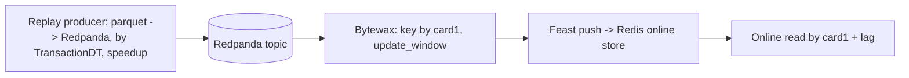

# Streaming (Phase 2)

Real-time path for the fraud subsystem: replay transactions into Redpanda, compute windowed
per-entity features with Bytewax, write them to the Redis online store via Feast.



## No train/serve skew - the core requirement
Online and offline features must be identical by definition, or the model sees one thing in
training and another at serving. Guarantee here: a single function `update_window(state, dt, amount)`
in `fraud_aml/streaming/features.py` is the only place window features are computed. Both paths call
it:
- offline batch: `add_stream_features(df)` groups by entity, sorts by TransactionDT (stable), applies
  `update_window` per event;
- online stream: the Bytewax `stateful_map` operator applies the same `update_window` per event.

Features: `win_count` (transactions in the last `window_seconds`), `win_sum` (amount sum in window),
`win_velocity` (sum / window_seconds), `win_delta` (seconds since the previous transaction of the
entity; -1 for the first).

### Equivalence cases checked (tests/test_stream_features.py)
`test_online_offline_equivalence` asserts offline == online across, specifically:
- **unseen entity** - the first transaction of a card (win_delta = -1, count = 1);
- **tie-break** - several transactions with the same TransactionDT (stable order, both counted);
- **window boundary** - a transaction exactly `window_seconds` after an earlier one is included
  (inclusive edge); one at `window_seconds + 1` evicts it;
- **sparse gap** - a large time gap empties the window (count resets to 1, win_delta is the full gap);
- **multi-entity interleave** - two cards interleaved keep independent state.

Order preservation is checked in `tests/test_producer_order.py` (producer emits by TransactionDT),
and the Bytewax dataflow is checked against the reducer in `tests/test_processor_bytewax.py`.

## Commands (Windows / WSL2)
The stream stack runs only in Docker; the producer and processor run via `uv` in WSL (not native
PowerShell).
```bash
docker compose -f infra/compose.stream.yaml up -d     # Redpanda + Redis + console (:8080)
uv run fraud-aml-produce --speedup 1000               # replay by time (X data-seconds = X/speedup real-seconds)
uv run fraud-aml-process                              # Bytewax fills Redis via Feast
uv run fraud-aml-stream-demo --card 12345            # read online features for a card
docker compose -f infra/compose.stream.yaml down
```
The processor can also run in a container; the WSL/uv path is simpler for local demos.

## Lag
The producer stamps each event with `publish_ts`; the processor stamps `processed_ts` when it emits
the feature. Lag = `processed_ts - publish_ts` (event to feature-ready), reported as p50 by the
processor. End-to-end lag to Redis includes the Feast push.

## Feast
`feast_repo/` defines the `card` entity and the `card_window` FeatureView backed by a PushSource;
online store is Redis, offline store is file (parquet). Apply once: `cd feast_repo && uv run feast
apply`. The processor writes with `store.push(...)`; the demo reads with `store.get_online_features`.
